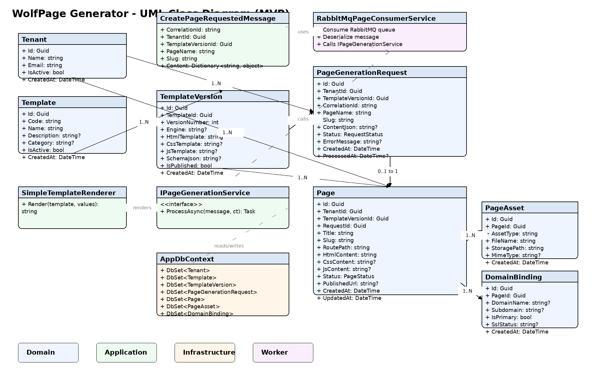

# WolfPage Generator Worker

`WolfPage Generator Worker` es un servicio en **.NET** que consume mensajes desde **RabbitMQ** para generar páginas web a partir de **templates almacenados en base de datos**.

El objetivo del proyecto es automatizar la creación de páginas para WolfPage a partir de una solicitud asíncrona, usando un modelo de templates versionados y persistiendo el resultado generado.

## Objetivo del proyecto

El worker recibe una solicitud de generación de página, consulta el template correspondiente, renderiza su contenido con los datos enviados en el mensaje y guarda el resultado final en la base de datos.

## Flujo general

1. Un productor publica un mensaje en RabbitMQ.
2. El worker consume el mensaje `CreatePageRequested`.
3. Se registra una `page_generation_request` para trazabilidad.
4. Se consulta la `template_version` correspondiente.
5. Se renderiza el HTML/CSS/JS con los datos del mensaje.
6. Se crea el registro final en `page`.
7. Se actualiza el estado de la solicitud a `Completed` o `Failed`.

## Tecnologías base

- .NET Worker Service
- C#
- RabbitMQ
- Entity Framework Core
- SQL Server
- EF Core Migrations

## Estructura de la solución

```text
WolfPage.Generator.sln
src/
├─ WolfPage.Generator.Domain/
│  ├─ Entities/
│  │  ├─ Tenant.cs
│  │  ├─ Template.cs
│  │  ├─ TemplateVersion.cs
│  │  ├─ PageGenerationRequest.cs
│  │  ├─ Page.cs
│  │  ├─ PageAsset.cs
│  │  └─ DomainBinding.cs
│  └─ Enums/
│     ├─ RequestStatus.cs
│     └─ PageStatus.cs
│
├─ WolfPage.Generator.Application/
│  ├─ Messages/
│  │  └─ CreatePageRequestedMessage.cs
│  ├─ Services/
│  │  ├─ IPageGenerationService.cs
│  │  └─ PageGenerationService.cs
│  └─ Rendering/
│     ├─ ITemplateRenderer.cs
│     └─ SimpleTemplateRenderer.cs
│
├─ WolfPage.Generator.Infrastructure/
│  ├─ Persistence/
│  │  └─ AppDbContext.cs
│  └─ Options/
│     └─ RabbitMqOptions.cs
│
└─ WolfPage.Generator.Worker/
   ├─ Consumers/
   │  └─ RabbitMqPageConsumerService.cs
   ├─ Program.cs
   └─ appsettings.json
```

## Diagrama UML

Guarda la imagen en:

```text
docs/uml/wolfpage_generator_uml.png
```

Y el README la mostrará así:



## Modelo principal

### Domain
Contiene las entidades y enums principales del negocio:
- `Tenant`
- `Template`
- `TemplateVersion`
- `PageGenerationRequest`
- `Page`
- `PageAsset`
- `DomainBinding`

### Application
Contiene los contratos y la lógica de aplicación:
- mensaje de entrada desde RabbitMQ
- servicio de generación de páginas
- renderer de templates

### Infrastructure
Contiene el acceso a datos y configuración técnica:
- `AppDbContext`
- opciones de RabbitMQ
- migrations de EF Core

### Worker
Contiene el host ejecutable y el consumer de RabbitMQ.

## Entidades principales

### `template`
Define la plantilla base.

### `template_version`
Guarda la versión concreta del template con HTML, CSS, JS y esquema.

### `tenant`
Representa el cliente o dueño del sitio.

### `page_generation_request`
Guarda la solicitud procesada por el worker.

### `page`
Guarda la página final generada.

### `page_asset`
Guarda archivos asociados a la página.

### `domain_binding`
Relaciona la página con un dominio o subdominio.

## Base de datos

Para SQL Server se recomienda usar:

- `uniqueidentifier` para IDs
- `nvarchar(...)` o `nvarchar(max)` para texto
- `bit` para booleanos
- `datetime2` para fechas

## Migrations

Crear migration:

```bash
dotnet ef migrations add InitialCreate \
  --project src/WolfPage.Generator.Infrastructure \
  --startup-project src/WolfPage.Generator.Worker
```

Aplicar migration:

```bash
dotnet ef database update \
  --project src/WolfPage.Generator.Infrastructure \
  --startup-project src/WolfPage.Generator.Worker
```

## Ejemplo de mensaje RabbitMQ

```json
{
  "correlationId": "REQ-0001",
  "tenantId": "11111111-1111-1111-1111-111111111111",
  "templateVersionId": "22222222-2222-2222-2222-222222222222",
  "pageName": "Mi barbería",
  "slug": "mi-barberia",
  "content": {
    "title": "Mi barbería",
    "heroText": "Cortes modernos y clásicos",
    "phone": "3001234567",
    "address": "Villavicencio",
    "primaryColor": "#111111"
  }
}
```

## Primer alcance sugerido

- Crear estructura base de proyectos.
- Crear entidades y enums.
- Crear `AppDbContext`.
- Crear consumer RabbitMQ.
- Crear el servicio de generación.
- Crear la primera migration.
- Probar el consumo con un mensaje manual.

## Siguientes mejoras recomendadas

- Idempotencia por `correlationId`
- Dead-letter queue
- Validación de `schema_json`
- Publicación de la página a storage o filesystem
- Eventos de éxito y error
- Tests unitarios e integración

## Primer commit sugerido

Opciones recomendadas:

```text
chore: create initial solution structure for wolfpage generator worker
```

```text
chore: add initial project structure and empty base classes
```

```text
feat: bootstrap wolfpage generator worker solution structure
```

La recomendación principal es esta:

```text
chore: create initial solution structure for wolfpage generator worker
```
